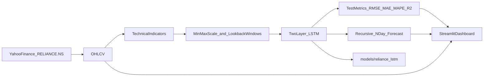

# Reliance LSTM Streamlit implementation plan

Finish a complete Reliance Industries LSTM price-prediction app: Yahoo Finance data, technical features, a 2-layer PyTorch LSTM, and a Streamlit dashboard for training, test metrics, and multi-day forecasts.

## Goal

Build a working end-to-end app that downloads **Reliance Industries (NSE: `RELIANCE.NS`)** history, trains an **LSTM** to predict next-day close, and exposes a full **Streamlit** UI (charts, train button, hold-out metrics, forward forecast). This is a research demo, not trading advice.

## Why PyTorch (not TensorFlow)

The machine’s default Python is **3.14**, which has **no TensorFlow wheels**. The LSTM is implemented in **PyTorch** and should be run from a **Python 3.13 venv** at `.venv`.

## Architecture



**Data pipeline** (`src/data.py`)

- Fetch `RELIANCE.NS` via `yfinance` (default **10y**, auto-adjusted OHLCV).
- Add features: SMA 20/50, EMA 12, RSI 14, MACD, Bollinger, ATR 14, OBV, plus Close and Volume.
- Scale with `MinMaxScaler`, build sequences of **lookback days** (default 60) to predict the **next scaled Close**.
- Chronological split: last **15%** of sequences = test; **10%** of the remaining train set = validation for early stopping.

**Model** (`src/model.py`)

- 2-layer LSTM (`units` then `units/2`) + dropout + dense head.
- Adam, MSE, gradient clip, ReduceLROnPlateau, early stop (patience 6).
- Save bundle: `lstm.pt`, `scaler.pkl`, `meta.pkl` under `models/reliance_lstm`.
- Forecast: recursive rollout; non-close features stay at last known values.

**UI** (`app.py`)

- Dark finance layout, sidebar: ticker, history window, lookback, units, dropout, epochs, batch size, forecast horizon, **Train LSTM**.
- Tabs: Market overview (candles + volume + latest metrics), Train LSTM (loss curve), Test predictions (actual vs predicted + RMSE/MAE/MAPE/R²), Forward forecast (next N business days).

**CLI train** (`train.py`) — same pipeline without the UI, for a one-shot 25-epoch fit.

## What is already done

- Source files: `app.py`, `src/data.py`, `src/model.py`, `train.py`, `requirements.txt`, `.gitignore`.
- Python 3.13 venv is created and packages are installed (torch, streamlit, yfinance, ta, plotly, scikit-learn).

## Remaining implementation steps

1. **Smoke-test data** — `fetch_reliance()` returns non-empty RELIANCE.NS rows; indicators have no NaNs after warmup drop.
2. **Train once** — run `train.py` (or the Streamlit Train button) so `models/reliance_lstm` exists and the UI is not empty on first open.
3. **Launch UI** — from project root, using the 3.13 venv:
   - `.venv\Scripts\python.exe -m streamlit run app.py`
4. **Verify in the app** — overview candles load; after train, test chart + metrics appear; forecast table/chart for 7 days; no crash if model is missing (warning only).
5. **Small robustness fixes if they show up** — yfinance MultiIndex columns (already handled), lookback mismatch vs saved model (reload using `meta["lookback"]` if needed), pandas Styler on mixed columns.

## How you run it

```text
d:\code\Stock Prediction Hp\.venv\Scripts\python.exe train.py
d:\code\Stock Prediction Hp\.venv\Scripts\python.exe -m streamlit run app.py
```

Do not use system Python 3.14 for this project.

## Out of scope

- Live brokerage / paper trading, options, or guaranteed profit claims.
- Multi-ticker portfolio optimizer (ticker box exists, default remains Reliance).
- TensorFlow (blocked on this Python version).
